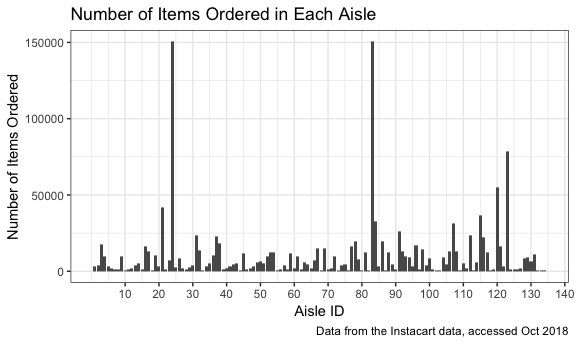

p8105\_hw3\_nc2710
================
Nicole Comfort
10/5/2018

Problem 1
---------

This problem uses data from the Behavioral Risk Factors Surveillance System for Selected Metropolitan Area Risk Trends (SMART) for 2002-2010, accessed from data.gov in Sept 2018 and downloaded from the p8105 github.

The dataset initially contains 134,203 rows and 23 columns. There is information on location, topic, question, response, and response number. The data is structured so that each (multiple-choice) response to each question is a separate row. A complete data dictionary is available online.

``` r
# install.packages("devtools")
library(devtools)
install_github("p8105/p8105.datasets", force = TRUE)
```

    ## Downloading GitHub repo p8105/p8105.datasets@master
    ## from URL https://api.github.com/repos/p8105/p8105.datasets/zipball/master

    ## Installing p8105.datasets

    ## '/Library/Frameworks/R.framework/Resources/bin/R' --no-site-file  \
    ##   --no-environ --no-save --no-restore --quiet CMD INSTALL  \
    ##   '/private/var/folders/wx/zjrcyp_x3m3_b758xtgrd11c0000gn/T/RtmpYNForc/devtools89babd33bf/P8105-p8105.datasets-21f5ad1'  \
    ##   --library='/Library/Frameworks/R.framework/Versions/3.5/Resources/library'  \
    ##   --install-tests

    ## 

``` r
library("p8105.datasets")
data("brfss_smart2010") # load the data
```

Do some data cleaning:

-   Format the data to use appropriate variable names

-   Focus on the "Overall Health" topic

-   Include only responses from "Excellent" to "Poor"

-   Organize responses as a factor taking levels ordered from "Excellent" to "Poor"

``` r
library(janitor)

brfss_smart2010 =
  clean_names(brfss_smart2010) %>% # format the data to use appropriate variable names
  filter(topic == "Overall Health") %>% # focus on the “Overall Health” topic, responses "Excellent" to "Poor"
  mutate(response = as.factor(response)) %>% # organize responses as a factor with 5 levels
  mutate(response = forcats::fct_relevel(response, c("Excellent", "Very good", "Good", "Fair", "Poor"))) # order
```

*Using this dataset, do or answer the following (commenting on the results of each)*:

-   In 2002, which states were observed at 7 locations?

The following states were observed at 7 locations in 2002: CT, FL, and NC.

``` r
brfss_2002 = 
  filter(brfss_smart2010, year == "2002") %>% # focus on year 2002
  distinct(locationdesc, .keep_all = TRUE) %>% # view the distinct locations for each state
  group_by(locationabbr) %>%  # group by state
  summarize(n = n()) # count the number of unique locations per state
```

-   Make a “spaghetti plot” that shows the number of locations in each state from 2002 to 2010.

The spaghetti plot is useful for showing general trends over time, such as the increase in locations surveyed in later years (2008-2010). However, it's difficult to identify the number of distinct locations surveyed for any individual state, because the lines overlap and the colors are too similar. Graphing by area of the country may be more informative.

``` r
# organize data
brfss_spaghetti =
  distinct(brfss_smart2010, locationdesc, .keep_all = TRUE) %>% 
  group_by(locationabbr, year) %>% 
  rename(State = locationabbr) %>% 
  summarize(n = n())

# make spaghetti plot
ggplot(brfss_spaghetti, aes(x = year, y = n)) + 
  geom_line(aes(color = State, alpha = 0.5)) + 
  labs(
    title = "Number of Locations Surveyed per State from 2002-2010",
    x = "Year",
    y = "Number of Distinct Locations (Counties)",
    caption = "Data from the Behavioral Risk Factors Surveillance System, 2002-2010"
  ) +
  theme_bw()
```


-   Make a table showing, for the years 2002, 2006, and 2010, the mean and standard deviation of the proportion of “Excellent” responses across locations in NY State.

The table shows that the average proportion of "Excellent" responses was highest in the year 2002 (24.0%), although this year also had the largest standard deviation (4.486). The standard deviation is decreasing over time, suggesting that perhaps more people/locations are being surveyed over time. The proportion of "Excellent" responses doesn't seem to vary too much over time, with a value of 24.0% in 2002, 22.5% in 2006, and 22.7% in 2010.

``` r
# create new dataset which focuses on NY state with years of interest and creates a new variable for the proportion of "excellent" response values 

brfss_table_data =
  filter(brfss_smart2010,
         locationabbr == "NY",
         year == "2002" | year == "2006" | year == "2010",
         response == "Excellent") %>%
  rename(Year = year) %>% 
  group_by(Year) %>% 
  summarize(mean_excellent = mean(data_value),   
            sd_excellent = sd(data_value)) %>% 
  knitr::kable(digits = 1,
               caption = "Proportion of 'Excellent' Responses Across Locations in NY State",
               col.names = c("Year", "Mean", "Standard Deviation"))

print(brfss_table_data)
```

    ## 
    ## 
    ## Table: Proportion of 'Excellent' Responses Across Locations in NY State
    ## 
    ##  Year   Mean   Standard Deviation
    ## -----  -----  -------------------
    ##  2002   24.0                  4.5
    ##  2006   22.5                  4.0
    ##  2010   22.7                  3.6

-   For each year and state, compute the average proportion in each response category (taking the average across locations in a state). Make a five-panel plot that shows, for each response category separately, the distribution of these state-level averages over time.

The five-panel plot shows the average proportion in each response category in the "Overall Health" topic, from "Excellent" to "Poor", averaged across county-level regions in each state. A blue loess smoothed conditional mean curve and 95% confidence interval is displayed. From this, we can see that "Very good" makes up the highest proportion of responses, followed by "good", "excellent", "fair", and "poor". It appears as though this proportion for each Overall Health state is not changing much over time.

``` r
# For each year and state, compute the average proportion in each response category (taking the average across locations in a state). 
brfss_panel = 
  group_by(brfss_smart2010, year, locationabbr, response) %>% # group by year, state, response category
  mutate(avg_response = mean(data_value)) 

# Make a five-panel plot that shows, for each response category separately, the distribution of these state-level averages over time. 

dist_exc_p = brfss_panel %>% 
  filter(response == "Excellent") %>% 
  ggplot(aes(x = year, y = avg_response)) +
  geom_line(aes(color = locationabbr, alpha  = 0.5)) + 
  geom_smooth(method = "loess", se = TRUE) +
  labs(title = "Excellent") +
  ylim(0, 50) +
  theme(legend.position = "none")

dist_vry_gd_p = brfss_panel %>% 
  filter(response == "Very good") %>% 
  ggplot(aes(x = year, y = avg_response)) +
  geom_line(aes(color = locationabbr, alpha  = 0.5)) + 
  geom_smooth(method = "loess", se = TRUE) +
  labs(title = "Very Good") +
  ylim(0, 50) +
  theme(legend.position = "none")

dist_good_p = brfss_panel %>% 
  filter(response == "Good") %>% 
  ggplot(aes(x = year, y = avg_response)) +
  geom_line(aes(color = locationabbr, alpha  = 0.5)) + 
  geom_smooth(method = "loess", se = TRUE) +
  labs(title = "Good") +
  ylim(0, 50) +
  theme(legend.position = "none")

dist_fair_p = brfss_panel %>% 
  filter(response == "Fair") %>% 
  ggplot(aes(x = year, y = avg_response)) +
  geom_line(aes(color = locationabbr, alpha  = 0.5)) + 
  geom_smooth(method = "loess", se = TRUE) +
  labs(title = "Fair") +
  ylim(0, 50) +
  theme(legend.position = "none")

dist_poor_p = brfss_panel %>% 
  filter(response == "Poor") %>% 
  ggplot(aes(x = year, y = avg_response)) +
  geom_line(aes(color = locationabbr, alpha  = 0.5)) + 
  geom_smooth(method = "loess", se = TRUE) +
  labs(title = "Poor") +
  ylim(0, 50) +
  theme(legend.position = "right")

# layer plots together
knitr::opts_chunk$set(
  fig.width = 6,
  fig.asp = .6,
  out.width = "95%"
)

dist_exc_p + dist_vry_gd_p + dist_good_p + dist_fair_p + dist_poor_p + plot_layout(ncol = 3, nrow = 2)
```

    ## Warning: Removed 71 rows containing non-finite values (stat_smooth).

    ## Warning: Removed 65 rows containing missing values (geom_path).

    ## Warning: Removed 80 rows containing non-finite values (stat_smooth).

    ## Warning: Removed 15 rows containing missing values (geom_path).

    ## Warning: Removed 130 rows containing non-finite values (stat_smooth).

    ## Warning: Removed 49 rows containing missing values (geom_path).

    ## Warning: Removed 12 rows containing non-finite values (stat_smooth).

    ## Warning: Removed 8 rows containing missing values (geom_path).

    ## Warning: Removed 8 rows containing non-finite values (stat_smooth).

    ## Warning: Removed 8 rows containing missing values (geom_path).


Problem 2
---------

This problem uses the Instacart data. DO NOT include this dataset in your local data directory; instead, load the data from the p8105.datasets package (it’s called instacart).

``` r
# install.packages("devtools")
devtools::install_github("p8105/p8105.datasets", force = TRUE)
```

    ## Installation failed: LibreSSL SSL_read: SSL_ERROR_SYSCALL, errno 60

``` r
library("p8105.datasets")
data("instacart")
```

*The goal is to do some exploration of this dataset. To that end, write a short description of the dataset, noting the size and structure of the data, describing some key variables, and giving illstrative examples of observations.*

The Instacart dataset contains 1384617 rows by 15 columns. The dataset contains information related to certain grocery products, such as a product's ID and location (aisle and department). For example, from the dataset we can see that Bulgarian Yogurt (product ID = 49302) is a product in the yogurt aisle (aisle ID = 120), which is in the dairy and eggs department. This information in the dataset comes from a dataset made of over 3 million online grocery orders from more than 200,000 Instacart users.

The dataset also contains information related to the ordering of a certain product, such as whether it's been reordered and if so, the number of days since the previous order as well as the day of week and hour of the day the order is placed. The day of the week is numbered from 0-6, assuming that 0 corresponds to Sunday sequentially until 6, corresponding to Saturday. The hour of the day ranges from 0 (12am) to 23 (11pm). The 'add\_to\_cart\_order' variable tells the order in which a given item was added to the shopping cart. The dataset is composed of integer and character variables (all variables are integers except for 'eval\_set', 'product\_name', 'aisle', and 'department'.) The 'reordered' variable is binary.

*Do or answer the following (commenting on the results of each)*:

-   How many aisles are there, and which aisles are the most items ordered from?

There are 134 aisles.

The most items are ordered from the Fresh Vegetables (150,609), Fresh Fruits (150,773), and Package Vegetables and Fruits (78,493). Perhaps items are ordered most frequently from these aisles because the food tends to spoil the fastest.

Banana is the most ordered item, followed by bag of organic bananas, followed by organic strawberries. All of these items are from the 'fresh fruits' aisle. In fact, the top 10 most ordered items all come from either the 'fresh fruits' aisle or 'packaged vegetables fruits' aisle.

``` r
# how many aisles are there
nrow(distinct(instacart, aisle_id))
```

    ## [1] 134

``` r
# which items are most ordered 
most_ordered_items =
  instacart %>% 
  group_by(product_name, aisle) %>% 
  summarize(n = n())

# which aisles are the most items ordered from
instacart %>% 
  group_by(aisle)  %>% 
  summarize(n = n())  %>% 
  arrange(desc(n))
```

    ## # A tibble: 134 x 2
    ##    aisle                              n
    ##    <chr>                          <int>
    ##  1 fresh vegetables              150609
    ##  2 fresh fruits                  150473
    ##  3 packaged vegetables fruits     78493
    ##  4 yogurt                         55240
    ##  5 packaged cheese                41699
    ##  6 water seltzer sparkling water  36617
    ##  7 milk                           32644
    ##  8 chips pretzels                 31269
    ##  9 soy lactosefree                26240
    ## 10 bread                          23635
    ## # ... with 124 more rows

-   Make a plot that shows the number of items ordered in each aisle. Order aisles sensibly, and organize your plot so others can read it.

This plot shows the number of items ordered in each aisle. Note that the x axis is ordered by aisle ID number. The Fresh Vegetables (150,609), Fresh Fruits (150,773), and Package Vegetables and Fruits (78,493) receive more than 3x the number of items ordered in comparison with other aisles, which tend to have about 50,000 or fewer orders.

``` r
items_ordered = instacart %>% 
  group_by(aisle_id) %>% 
  summarize(number_orders = n())

as.tibble(items_ordered) %>% 
  ggplot(aes(x = aisle_id, y = number_orders)) +
  geom_bar(stat = "identity") +
    labs(
    title = "Number of Items Ordered in Each Aisle",
    x = "Aisle ID",
    y = "Number of Items Ordered",
    caption = "Data from the Instacart data, accessed Oct 2018"
  ) +
  scale_x_continuous(breaks = c(10, 20, 30, 40, 50, 60, 70, 80, 90, 100, 110, 120, 130, 140),
                     minor_breaks = waiver(),
                     labels = c("10", "20", "30", "40", "50", "60", "70", "80", "90", "100", "110", "120", "130", "140"))
```



-   Make a table showing the most popular item in each of the aisles “baking ingredients”, “dog food care”, and “packaged vegetables fruits”.

From the table, we can see that the most popular baking ingredient is the 100% Organic Unbleached All-Purpose Flour. The most popular dog food item is the Chopped Blends With Lamb Brown Rice Carrots Tomatoes & Spinach Dog Food, while the most popular packaged vegetables fruits item is Super Greens Salad.

``` r
pop_items_table =
  instacart %>%
  filter(aisle == "baking ingredients" | aisle == "dog food care" | aisle == "packaged vegetables fruits") %>%
  group_by(aisle) %>%
  summarize(most_pop_item = first(product_name)) %>%
  knitr::kable(col.names = c("Aisle", "Most Popular Item"))
  
print(pop_items_table)
```

    ## 
    ## 
    ## Aisle                        Most Popular Item                                                       
    ## ---------------------------  ------------------------------------------------------------------------
    ## baking ingredients           100% Organic Unbleached All-Purpose Flour                               
    ## dog food care                Chopped Blends With Lamb Brown Rice Carrots Tomatoes & Spinach Dog Food 
    ## packaged vegetables fruits   Super Greens Salad

-   Make a table showing the mean hour of the day at which Pink Lady Apples and Coffee Ice Cream are ordered on each day of the week; format this table for human readers (i.e. produce a 2 x 7 table).

The hour of the day is based on a 24-hr clock, with the decimals representing the fraction of an hour. We assume that "0" in the original dataset corresponds to Sunday. From the table, we can ascertain that ice cream is ordered later in the day than is Pink Lady Apples, except for Sunday, when perhaps people are doing all their weekly grocery shopping at once.

``` r
hr_of_day_table =
  instacart %>%
  select(product_name, order_dow, order_hour_of_day) %>% 
  filter(product_name == "Pink Lady Apples" | product_name == "Coffee Ice Cream") %>% 
  group_by(product_name, order_dow) %>%
  summarize(mean_hr = mean(order_hour_of_day)) %>% 
  spread(key = order_dow, value = mean_hr) %>% 
  knitr::kable(., col.names = c("Product Name",
                               "Sunday",
                               "Monday",
                               "Tuesday",
                               "Wednesday",
                               "Thursday",
                               "Friday",
                               "Saturday"))

print(hr_of_day_table)
```

    ## 
    ## 
    ## Product Name          Sunday     Monday    Tuesday   Wednesday   Thursday     Friday   Saturday
    ## -----------------  ---------  ---------  ---------  ----------  ---------  ---------  ---------
    ## Coffee Ice Cream    13.77419   14.31579   15.38095    15.31818   15.21739   12.26316   13.83333
    ## Pink Lady Apples    13.44118   11.36000   11.70213    14.25000   11.55172   12.78431   11.93750

Problem 3
---------

This problem uses the NY NOAA data, downloaded from the p8105.datasets package called ny\_noaa.

``` r
# install.packages("devtools")
library(devtools)
install_github("p8105/p8105.datasets", force = TRUE)
```

    ## Downloading GitHub repo p8105/p8105.datasets@master
    ## from URL https://api.github.com/repos/p8105/p8105.datasets/zipball/master

    ## Installing p8105.datasets

    ## '/Library/Frameworks/R.framework/Resources/bin/R' --no-site-file  \
    ##   --no-environ --no-save --no-restore --quiet CMD INSTALL  \
    ##   '/private/var/folders/wx/zjrcyp_x3m3_b758xtgrd11c0000gn/T/Rtmp6CGuTj/devtoolsb9f182634a1/P8105-p8105.datasets-21f5ad1'  \
    ##   --library='/Library/Frameworks/R.framework/Versions/3.5/Resources/library'  \
    ##   --install-tests

    ## 

``` r
library("p8105.datasets")
```

    ## 
    ## Attaching package: 'p8105.datasets'

    ## The following object is masked _by_ '.GlobalEnv':
    ## 
    ##     brfss_smart2010

``` r
data("ny_noaa")

# list rows of data that have missing values 
missing_noaa = ny_noaa[!complete.cases(ny_noaa),]
```

*The goal is to do some exploration of this dataset. To that end, write a short description of the dataset, noting the size and structure of the data, describing some key variables, and indicating the extent to which missing data is an issue.*

The ny\_noaa dataset is a large dataset which comes from the New York state weather stations from Jan 1, 1981 to Dec 31, 2010; the dataset is comprised of 2595176 observations of 2595176 variables. These key variables are ID (character, for weather station ID), Date (date), Precipitation (integer), Snow (integer), snow depth (integer), and maximum/minimum observed temperature, which is stored as character variables. I'm also assuming (based on looking at the values) that the temperature variable is in the units of Fahrenheit.

Missing data is definitely an issue in this dataset. When I create a tibble comprised of missing values, it results in a dataset comprised of 1372743 observations of 1372743 variables. This means that more than half of the ny\_noaa data (almost 53%) contains some missing data.

*Then, do or answer the following (commenting on the results of each)*:

-   Do some data cleaning. Create separate variables for year, month, and day. Ensure observations for temperature, precipitation, and snowfall are given in reasonable units. For snowfall, what are the most commonly observed values? Why?

In my data cleaning, I created variables for year, month, and day and converted the units for the precipitation variable to millimeters and the units for max and min temp to degrees Celsius.

I noticed that the minimum for the "snow" variable is one observation reading -13, which is not reasonable/expected and therefore I'm assuming would be an input error. I would go back to the original data collection form to double-check the recorded value. Otherwise, the minimum is 0 as expected and appears in many cases.

For snowfall, the most commonly observed values are 0mm and NA. This makes sense because there is a lot of missing data and also, most days out of the year it is not snowing in NY.

``` r
library(lubridate)
```

    ## 
    ## Attaching package: 'lubridate'

    ## The following object is masked from 'package:base':
    ## 
    ##     date

``` r
ny_noaa = mutate(ny_noaa, year = year(ny_noaa$date)) # new variable for year
ny_noaa = mutate(ny_noaa, month = month(ny_noaa$date)) # new variable for month
ny_noaa = mutate(ny_noaa, day = day(ny_noaa$date)) # new variable for day 

ny_noaa %>%
  mutate(tmax = as.numeric(tmax),
         tmin = as.numeric(tmin),
         prcp = prcp / 10,
         tmax = tmax * (9 / 5) + 32,
         tmin = tmax * (9 / 5) + 32)
```

    ## # A tibble: 2,595,176 x 10
    ##    id          date        prcp  snow  snwd  tmax  tmin  year month   day
    ##    <chr>       <date>     <dbl> <int> <int> <dbl> <dbl> <dbl> <dbl> <int>
    ##  1 US1NYAB0001 2007-11-01    NA    NA    NA    NA    NA  2007    11     1
    ##  2 US1NYAB0001 2007-11-02    NA    NA    NA    NA    NA  2007    11     2
    ##  3 US1NYAB0001 2007-11-03    NA    NA    NA    NA    NA  2007    11     3
    ##  4 US1NYAB0001 2007-11-04    NA    NA    NA    NA    NA  2007    11     4
    ##  5 US1NYAB0001 2007-11-05    NA    NA    NA    NA    NA  2007    11     5
    ##  6 US1NYAB0001 2007-11-06    NA    NA    NA    NA    NA  2007    11     6
    ##  7 US1NYAB0001 2007-11-07    NA    NA    NA    NA    NA  2007    11     7
    ##  8 US1NYAB0001 2007-11-08    NA    NA    NA    NA    NA  2007    11     8
    ##  9 US1NYAB0001 2007-11-09    NA    NA    NA    NA    NA  2007    11     9
    ## 10 US1NYAB0001 2007-11-10    NA    NA    NA    NA    NA  2007    11    10
    ## # ... with 2,595,166 more rows

``` r
# are observations for temp, precipitation, and snowfall in reasonable units? 
max(ny_noaa$prcp, na.rm = TRUE) 
```

    ## [1] 22860

``` r
min(ny_noaa$prcp, na.rm = TRUE)
```

    ## [1] 0

``` r
max(ny_noaa$tmax, na.rm = TRUE) # assuming temp is in Fahrenheit
```

    ## [1] "99"

``` r
min(ny_noaa$tmax, na.rm = TRUE) 
```

    ## [1] "-1"

``` r
max(ny_noaa$tmin, na.rm = TRUE)
```

    ## [1] "99"

``` r
min(ny_noaa$tmin, na.rm = TRUE)
```

    ## [1] "-1"

``` r
max(ny_noaa$snow, na.rm = TRUE) # what value is this?? 
```

    ## [1] 10160

``` r
min(ny_noaa$snow, na.rm = TRUE) # - 13 for snow doesn't make sense...
```

    ## [1] -13

``` r
# For snowfall, what are the most commonly observed values? Why? 
ny_noaa_snow = ny_noaa %>% 
  group_by(snow) %>%  # group by snow
  summarize(n = n())
```

-   Make a two-panel plot showing the average temperature in January and in July in each station across years. Is there any observable / interpretable structure? Any outliers?

The largest outlier is seen in July 1988. Other outliers occur in July 1984 and July 2004. Note that "1" refers to month = January and "7" refers to month = July. Over time, the temperature oscillates up and down (likely with summer and winter), however I'm surprised that I don't notice an observable increase in temperature over time (due to global warming).

``` r
# NOTE: Wanted to make an avg_temp variable which == tmax + tmin / 2, but that never ended up working...

# plot the two panel plot using facet rather than patchwork 
tmax_jan_jul_plot = ny_noaa %>%
  filter(month == "1" | month == "7") %>%
  mutate(year = as.numeric(year), tmax = as.numeric(tmax), tmin = as.numeric(tmin)) %>%
  group_by(id, year) %>%
  mutate(avg_temp = (tmax+tmin)/2)

ggplot(tmax_jan_jul_plot, aes(x = year, y = avg_temp)) +
    geom_line(aes(color = id), alpha = 0.5, size = 0.05) +
    facet_grid(~month) +
    labs(
      title = "New York average maximum temperatures",
      x = "Year",
      y = "Mean maximum daily temperature (deg C)",
      caption = "Data from the rnoaa package"
    ) +
    scale_x_continuous(breaks = c(1980, 1985, 1990, 1995, 2000, 2005, 2010)) +
    theme(legend.position = "none")
```

    ## Warning: Removed 175017 rows containing missing values (geom_path).


``` r
tmax_jan_jul_plot
```

    ## # A tibble: 437,441 x 11
    ## # Groups:   id, year [7,409]
    ##    id    date        prcp  snow  snwd  tmax  tmin  year month   day
    ##    <chr> <date>     <int> <int> <int> <dbl> <dbl> <dbl> <dbl> <int>
    ##  1 US1N… 2008-01-01     0     0   343    NA    NA  2008     1     1
    ##  2 US1N… 2008-01-02    86   109   445    NA    NA  2008     1     2
    ##  3 US1N… 2008-01-03     0     0   432    NA    NA  2008     1     3
    ##  4 US1N… 2008-01-04     0     0    NA    NA    NA  2008     1     4
    ##  5 US1N… 2008-01-05     0     0   305    NA    NA  2008     1     5
    ##  6 US1N… 2008-01-06     0     0   267    NA    NA  2008     1     6
    ##  7 US1N… 2008-01-07     0     0   191    NA    NA  2008     1     7
    ##  8 US1N… 2008-01-08     0     0    89    NA    NA  2008     1     8
    ##  9 US1N… 2008-01-09     0     0    38    NA    NA  2008     1     9
    ## 10 US1N… 2008-01-10     0     0     0    NA    NA  2008     1    10
    ## # ... with 437,431 more rows, and 1 more variable: avg_temp <dbl>

``` r
# ny_noaa =
#   mutate(avg_temp = ((ny_noaa$tmax + ny_noaa$tmin)/2)) # new var for avg temp
 
# # Another way: make 2 plots and then stack them on top of one another 
# ny_noaa_jan =
#   filter(ny_noaa, month == "1") %>% # look at Jan
#   group_by(id, year) %>% # look at each station and year
#   mutate(avg_tmp_jan = mean(avg_temp))
# 
# ny_noaa_jul =
#   filter(ny_noaa, month == "7") %>% # look at Jul
#   group_by(id, year) %>% # look at each station and year
#   mutate(avg_tmp_jul = mean(avg_temp))
# 
# # Make two plots
# avg_tmp_jan_plot =
#   ggplot(ny_noaa_jan, aes(x = year, y = avg_tmp_jan)) +
#   geom_line(aes(color = id)) +
#   labs(
#     title = "Average Temperature Recorded at Weather Stations Across Years",
#     x = "Year",
#     y = "Weather Station ID",
#     caption = "Data from the NY NOAA, acccessed Oct 2018"
#   ) +
#   theme_bw()
# 
# avg_tmp_jul_plot =
#   ggplot(ny_noaa_jul, aes(x = year, y = avg_tmp_jul)) +
#   geom_line(aes(color = id)) +
#   labs(
#     title = "Average Temperature Recorded at Weather Stations Across Years",
#     x = "Year",
#     y = "Weather Station ID",
#     caption = "Data from the NY NOAA, acccessed Oct 2018"
#   ) +
#   theme_bw()
# 
# avg_tmp_jan_plot + avg_tmp_jul_plot + plot_layout(nrow = 2)
```

-   Make a two-panel plot showing (i) tmax vs tmin for the full dataset (note that a scatterplot may not be the best option); and (ii) make a plot showing the distribution of snowfall values greater than 0 and less than 100 separately by year.

The first graph shows maximum daily temperature plotted against minimum daily temperatures for NY state. The plot is a hexagonal heatmap (Note: The code WAS producing a normal looking graph, but now I am on a new computer, Windows vs. Mac and it looks distorted). We see two hotspots, at a maximum temperature of ~5 degees C and at 27 degrees C.

The second graph (on the right) is a violin plot with quartile lines showing the distribution of snowfall values greater than 0 and less than 100 from 1981 to 2010. I don't observe any trends from this graph.

``` r
# Note: user may have to install the hexbin package. 
library(hexbin)

# plot tmax vs tmin for full dataset
temp_plot =
  ny_noaa %>% 
  mutate(tmax = as.numeric(tmax), tmin = as.numeric(tmin)) %>% 
  ggplot(aes(x = tmin, y = tmax)) + 
  geom_hex() +
  labs(
    title = "Max vs. Min Temp for NY NOAA Weather Data",
    x = "Minimum Temperature (Celsius)",
    y = "Maximum Temperature (Celsius)"
  ) +
  theme(legend.position = 'right', 
        legend.text = element_text(margin = margin(t = 10)))

temp_plot
```

    ## Warning: Removed 1136276 rows containing non-finite values (stat_binhex).


``` r
# plot distribution of snowfall values greater than 0 and less than 100
ny_noaa_snow = 
  filter(ny_noaa, !is.na(snow)) %>% # omit rows without snow data
  filter(snow > 0 & snow < 100) %>% 
  group_by(year) %>% 
  ggplot(aes(x = year, y = snow)) +
  geom_violin(draw_quantiles = c(0.25, 0.5, 0.75)) +
  labs(title = "Snow distrib's",
       y = "Snowfall (mm)")

# layer plots together 
temp_plot + plot_spacer() + ny_noaa_snow
```

    ## Warning: Removed 1136276 rows containing non-finite values (stat_binhex).


